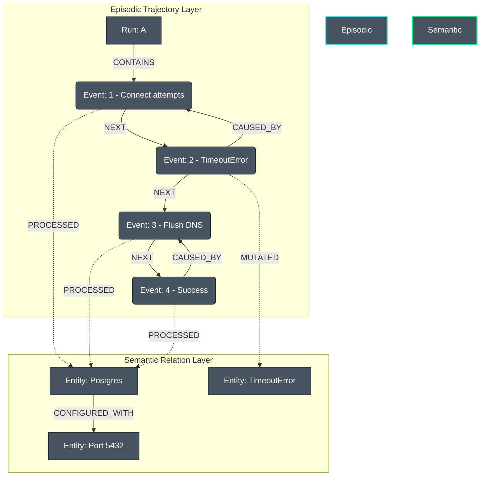
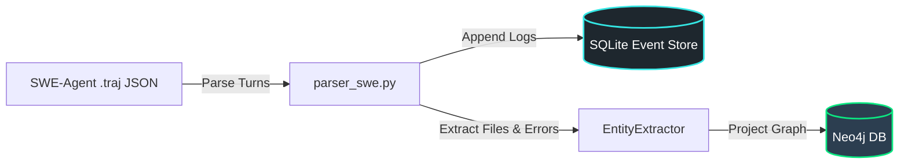

# Semantic Agent Graph (SAG)

[](https://www.python.org/)
[](https://opensource.org/licenses/Apache-2.0)
[](https://python-poetry.org/)

**Semantic Agent Graph (SAG)** is an event-sourced cognitive memory framework for autonomous agents. It bridges **Episodic Memory** (the chronological trajectory of an agent's execution experience) with a global **Semantic Relation Layer** (representing software files, system configurations, and error tracebacks). 

Rather than querying unstructured vector databases (RAG), the agent retrieves memory as a **structured sub-graph**, enabling it to recall the **exact chronological sequence of steps** (e.g. resolution pathways) that successfully solved a similar problem in past runs, and **cheaply fork** those pathways to test new hypotheses.

---

## Academic Attribution & Context

This project builds directly upon the foundational research of **Yohei Nakajima** (creator of *BabyAGI*):

> [!IMPORTANT]
> **Foundational Paper Reference:**  
> Yohei Nakajima et al. (May 2026).  
> *"The Log is the Agent: Event-Sourced Reactive Graphs for Auditable, Forkable Agentic Systems"* (arXiv:2605.21997).  
> *Foundational Repository:* [yoheinakajima/activegraph](https://github.com/yoheinakajima/activegraph)

### The ActiveGraph Thesis: "The Log is the Agent"
Traditional agent loops treat execution logic as the core state, with logging and tracing as secondary layers. ActiveGraph inverts this design:
1.  **The Event Log is the Source of Truth:** Every decision, prompt, LLM call, and tool output is saved to an append-only event log.
2.  **The Graph is a Projection:** The system's state (nodes and relationships) is a deterministic view reconstructed by replaying the event log sequentially.
3.  **Reactive Behaviors:** Computational units (behaviors) subscribe to specific graph patterns and trigger asynchronously, writing new events back to the log.

---

## Our Improvement: "Blooming" the Log

While ActiveGraph isolates individual run trajectories to evaluate structural lineage, **Semantic Agent Graph (SAG)** introduces **Episodic-Semantic Blooming**. 

We bridge the agent's episodic execution logs with a global **Semantic Relation Layer** containing normalized entities (such as software files, python classes, third-party libraries, and system error tracebacks).

### The Unified "Bloomed" Architecture
*   **Episodic Trajectory Layer:** Captures the unique chronological runs, sequential events, parent forks, and causal lineages.
*   **Semantic Relation Layer:** Captures global canonical concepts, packages, configurations, and errors (e.g., `Postgres`, `Port 5432`, `TimeoutError`) normalized to prevent graph drift.
*   **The Bloom (Cross-Graph Bridge):** Event nodes are linked to the global semantic nodes they read/modified using `[:PROCESSED]` or `[:MUTATED]` relationships.



---

## Predictive Dead-End Detection & Backtracking

> [!TIP]
> **Enterprise Cost & Latency Saver:**  
> Agentic loops are expensive and long-running. If an agent executes a sequence of actions that matches a path that failed in past runs, continuing down that path wastes time and LLM API cost.

By mapping both **successful** and **failed** runs, SAG enables **proactive backtracking** during runtime. The agent queries its current trajectory prefix against the global memory graph. If the graph projects a 100% failure rate for that trajectory pattern, the runtime **aborts the branch, forks back to the last stable state, and redirects the agent.**

```mermaid
flowchart TD
    %% Define Nodes
    A[Agent Execution Start] --> B{Step Executed}
    B --> C[Extract prefix entities]
    C --> D[Query Neo4j Memory Graph]
    D --> E{Historical Failure Rate >= 90%?}
    
    %% Decision branches
    E -- No --> F[Proceed to next step]
    F --> B
    
    E -- Yes: Dead End Detected --> G[Halt execution branch]
    G --> H[Fork run back to last stable state]
    H --> I[Inject feedback: 'Avoid path [X, Y, Z]']
    I --> B
    
    %% Styles
    style E fill:#ff3f34,stroke:#1e272e,color:#fff
    style G fill:#ff5e57,stroke:#1e272e,color:#fff
    style H fill:#ffd32a,stroke:#1e272e,color:#000
    style I fill:#0be881,stroke:#1e272e,color:#000
    classDef default fill:#485460,stroke:#1e272e,color:#fff
```

### The Cypher Memory Query
```cypher
// Query to detect if our current run's prefix entities match historical failures
MATCH (h_run:Run)-[:CONTAINS]->(e:Event)-[:PROCESSED]->(shared:Entity)
WHERE h_run.run_id <> $current_run_id AND shared.name IN $current_prefix_entities
WITH h_run, count(shared) AS matched_entities_count
MATCH (h_run)-[:CONTAINS]->(terminal:Event)
WHERE terminal.type IN ["run.completed", "run.failed"]
RETURN terminal.type AS outcome, count(h_run) AS run_count, matched_entities_count
ORDER BY matched_entities_count DESC
```

---

## Ingesting SWE-Agent Trajectories

To bridge SAG into production-grade benchmarks, we implemented a specialized **SWE-agent Trajectory Ingestion Pipeline** located in [parser_swe.py](file:///c:/Users/ASUS/Desktop/projects/Agent-Log-Graph/semantic_agent_graph/parser_swe.py).

### How Ingestion Works
The pipeline parses standard SWE-agent `.traj` JSON interaction logs. It translates the raw model turns (thoughts, actions, observations) into episodic events and blooms them with canonical software components.



*   **Episodic Mapping:** Turns are mapped as `agent.step` events connected by chronological `[:NEXT]` edges and causal `[:CAUSED_BY]` links.
*   **Semantic Mapping:** Files modified (e.g. `query.py`), pytest commands, and runtime exceptions (e.g. `AttributeError`) are automatically extracted and merged into global Neo4j `Entity` nodes, linked to the execution steps.

---

## How It Works (CQRS Pattern)

SAG is implemented using a Command Query Responsibility Segregation (**CQRS**) architecture:

1.  **Command Model (Write-optimized SQLite):** Sequential, append-only logs are committed instantly to SQLite. This guarantees high-throughput write performance, transaction isolation, and linear replays.
2.  **Read Model (Query-optimized Neo4j):** SQLite events are projected in real time into **Neo4j** to form the bloomed graph.
3.  **Determinism Cache Contract:** Non-deterministic LLM or tool responses are cached as `llm.responded` pairs keyed by prompt hash. During replays, responses are fetched from the log cache.
4.  **Raw Path Graph Memory Tool:** When the agent encounters a block, it queries the memory tool with its current entity signature. The tool queries Neo4j using Cypher and returns a **Neo4j Path Graph** containing the raw list of nodes and relationships of successful past runs.

---

## Project Structure

*   [semantic_agent_graph/](file:///c:/Users/ASUS/Desktop/projects/Agent-Log-Graph/semantic_agent_graph): The core source code directory.
    *   [__init__.py](file:///c:/Users/ASUS/Desktop/projects/Agent-Log-Graph/semantic_agent_graph/__init__.py): Exposes models, store, runtime, extraction, memory, and parser APIs.
    *   [models.py](file:///c:/Users/ASUS/Desktop/projects/Agent-Log-Graph/semantic_agent_graph/models.py): Pydantic models mapping `Event`, `Run`, `Entity`, and `Relation`.
    *   [store.py](file:///c:/Users/ASUS/Desktop/projects/Agent-Log-Graph/semantic_agent_graph/store.py): SQLite Event Store handling streams, runs, and local branching.
    *   [runtime.py](file:///c:/Users/ASUS/Desktop/projects/Agent-Log-Graph/semantic_agent_graph/runtime.py): Event loop runtime, behaviors, context vars, and cache contract.
    *   [projection.py](file:///c:/Users/ASUS/Desktop/projects/Agent-Log-Graph/semantic_agent_graph/projection.py): Neo4j Cypher projection engine syncing events to the graph.
    *   [extraction.py](file:///c:/Users/ASUS/Desktop/projects/Agent-Log-Graph/semantic_agent_graph/extraction.py): Hybrid extraction module combining Regex rules and Gemini.
    *   [memory.py](file:///c:/Users/ASUS/Desktop/projects/Agent-Log-Graph/semantic_agent_graph/memory.py): Neo4j query tool extracting sub-graphs of successful histories.
    *   [parser_swe.py](file:///c:/Users/ASUS/Desktop/projects/Agent-Log-Graph/semantic_agent_graph/parser_swe.py): Trajectory parser matching standard `.traj` schema.
*   [tests/](file:///c:/Users/ASUS/Desktop/projects/Agent-Log-Graph/tests): Fully automated test suite.
    *   [test_runtime.py](file:///c:/Users/ASUS/Desktop/projects/Agent-Log-Graph/tests/test_runtime.py): Tests store logic, behaviors, loops, and caching.
    *   [test_extraction.py](file:///c:/Users/ASUS/Desktop/projects/Agent-Log-Graph/tests/test_extraction.py): Tests regex patterns and canonical normalization.
    *   [test_parser.py](file:///c:/Users/ASUS/Desktop/projects/Agent-Log-Graph/tests/test_parser.py): Ingestion parser test cases.
*   [demo.py](file:///c:/Users/ASUS/Desktop/projects/Agent-Log-Graph/demo.py): End-to-end integration demo script.
*   [benchmark.py](file:///c:/Users/ASUS/Desktop/projects/Agent-Log-Graph/benchmark.py): Performance evaluation benchmark.
*   [RESEARCH.md](file:///c:/Users/ASUS/Desktop/projects/Agent-Log-Graph/RESEARCH.md): Deep-dive guide for academic researchers and evaluation.
*   [TESTING.md](file:///c:/Users/ASUS/Desktop/projects/Agent-Log-Graph/TESTING.md): Quickstart instructions on executing unit and integration tests.

---

## Detailed Quickstart & API Reference

### 1. Initializing the Event Store & Neo4j Projection

```python
from semantic_agent_graph import SQLiteEventStore, Neo4jProjection

# Initialize the write-model event store (SQLite)
store = SQLiteEventStore("runs.db")

# Initialize the read-model projection engine (Neo4j)
projection = Neo4jProjection(
    uri="bolt://localhost:7687",
    auth=("neo4j", "password")
)
```

### 2. Creating and running a Reactive Loop Runtime

```python
from semantic_agent_graph import ReactiveRuntime, Run

# Wire them together into the runtime
runtime = ReactiveRuntime(store=store, projection=projection)

# Create a new run
run = Run(
    run_id="run_101",
    label="Database Connection Task",
    created_at="2026-06-23T12:00:00Z",
    goal="Connect to Postgres on port 5432"
)
store.create_run(run)

# Register behaviors subscribing to event types
@runtime.behavior(on_events=["database.error"])
def handle_db_error(rt, event):
    print(f"Triggered by error: {event.payload.get('error')}")
    # Emit a resolution attempt event
    rt.emit("dns.flush", {"action": "Flushed DNS cache"})

# Scope emissions to the active run
with runtime.active_run(run.run_id):
    runtime.emit("database.error", {"error": "Connection timed out"})
    
    # Process events in the queue
    runtime.dispatch_loop()
```

### 3. Extracting Entities & Mapping Relations

```python
from semantic_agent_graph import EntityExtractor

extractor = EntityExtractor(api_key="YOUR_GEMINI_API_KEY")

log_message = "Failed to connect to postgresql database at port 5432: connectiontimeout"
entities, relations = extractor.extract(log_message)

for entity in entities:
    # Normalized to Postgres, Port 5432, and TimeoutError
    print(f"Extracted Entity: {entity.name} (Type: {entity.type})")

for relation in relations:
    print(f"Relation: ({relation.source})-[:{relation.type}]->({relation.target})")
```

### 4. Querying Successful Past Trajectories

```python
from semantic_agent_graph import Neo4jMemoryTool

with Neo4jMemoryTool() as memory:
    # Query Neo4j to find sub-graphs of successful runs that processed Postgres and TimeoutError
    result = memory.query_past_trajectories(["Postgres", "TimeoutError"])
    
    print("Found nodes:")
    for node in result["nodes"]:
        print(f" - {node['id']} (Labels: {node['labels']})")
```

---

## Setup & Local Installation

### Prerequisites
*   Python 3.10+
*   Poetry 2.0+
*   A running Neo4j Instance (at `bolt://localhost:7687` with credentials `neo4j/password` for local testing)

### Installation
Clone the repository and install dependencies using Poetry:
```bash
git clone https://github.com/erdometo/semantic-agent-graph.git
cd semantic-agent-graph
poetry install --no-root
```

### Running the Tests
To run the automated test suite verifying SQLite concurrency, event sequencing, extraction, caching, and parsing:
```bash
poetry run python -m pytest
```

### Running the Integration Demo
To execute the simulated connection failure scenario:
```bash
poetry run python demo.py
```

### Running the Trajectory Parser
To run the SWE-agent trajectory ingestion demo locally (creates a sample JSON and ingests it):
```bash
poetry run python -m semantic_agent_graph.parser_swe
```

---

## Performance Benchmarks

To run the benchmarks comparing CQRS database latencies and cache replay speeds:
```bash
poetry run python benchmark.py
```

### 1. CQRS Database Write Latency (SQLite vs. Neo4j)
*   **SQLite Event Store Write:** **0.016 ms / event** (appends 100 events in 1.6 ms)
*   **Neo4j Projection Write (Simulated):** **16.218 ms / event**
*   **Write Buffer Performance:** SQLite is **1,020.1x faster** than Neo4j transactions.
*   *Verdict:* Proves that writing sequential events directly to a local append-only buffer (SQLite) is essential to prevent network transactions from blocking the agent's reactive execution loop.

### 2. Replay Caching (Determinism Contract)
*   **Live Execution (5 LLM Calls, 200ms latency):** **1.0327 seconds**
*   **Replay Execution (5 LLM Calls, 100% Cache Hits):** **0.0012 seconds**
*   **Replay Performance Speedup:** Replay is **862.7x faster** than live execution.
*   *Verdict:* Confirms that the prompt-hashing Cache Contract completely eliminates API calls and network latencies during replay or run branching, reducing RTT to virtually zero.
