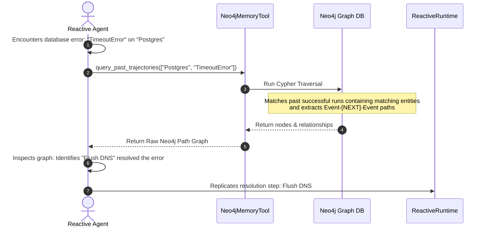

# Semantic Agent Graph (SAG)

[](https://www.python.org/)
[](https://opensource.org/licenses/Apache-2.0)
[](https://python-poetry.org/)

**Semantic Agent Graph (SAG)** is an advanced event-sourced agent memory framework. It extends the core thesis of event-sourced reactive agents by bridging **Episodic Memory** (the sequential trajectory of agent experiences) with a **Semantic Relation Graph** (real-world canonical concepts, errors, and system schemas). 

Rather than querying unstructured vector databases (RAG), the agent retrieves memory as a **structured sub-graph**, enabling it to recall the **exact chronological sequence of steps** (e.g. resolution pathways) that successfully solved a similar problem in past runs, and **cheaply fork** those pathways to test new hypotheses.

---

## Academic Attribution & Context

This project builds directly upon the foundational research of **Yohei Nakajima** (creator of *BabyAGI*):

> ** foundational Paper:**  
> Yohei Nakajima et al. (May 2026).  
> *"The Log is the Agent: Event-Sourced Reactive Graphs for Auditable, Forkable Agentic Systems"* (arXiv:2605.21997).  
> *Foundational Repository:* [yoheinakajima/activegraph](https://github.com/yoheinakajima/activegraph)

### The ActiveGraph Thesis: "The Log is the Agent"
Traditional agent loops treat execution logic as the core state, with logging and tracing as secondary layers. Nakajima's **ActiveGraph** inverts this:
1.  **The Event Log is the Source of Truth:** Every decision, prompt, LLM call, and tool output is saved to an append-only event log.
2.  **The Graph is a Projection:** The system's state (nodes and relationships) is a deterministic view reconstructed by replaying the event log sequentially.
3.  **Reactive Behaviors:** Computational units (behaviors) subscribe to specific graph patterns and trigger asynchronously, writing new events back to the log.

---

## Our Improvement: "Blooming" the Log

While ActiveGraph isolates individual run trajectories to evaluate structural lineage, **Semantic Agent Graph (SAG)** introduces **Episodic-Semantic Blooming**. 

Most agents fail to generalize past runs because their memory is either a flat list of text vectors (which lacks relational context) or a pure knowledge graph (which lacks chronological context). We bridge these layers by overlaying a global **Semantic Relation Layer** onto the episodic execution logs using cross-graph relations.

### The Unified "Bloomed" Architecture
*   **Episodic Trajectory Layer:** Captures the unique chronological runs, sequential events, parent forks, and causal lineages.
*   **Semantic Relation Layer:** Captures global canonical concepts, packages, configurations, and errors (e.g., `Postgres`, `Port 5432`, `TimeoutError`) normalized to prevent graph drift.
*   **The Bloom (Cross-Graph Bridge):** Event nodes are linked to the global semantic nodes they read/modified using `[:PROCESSED]` or `[:MUTATED]` relationships.


---

## How It Works

SAG is implemented using a Command Query Responsibility Segregation (**CQRS**) architecture:

1.  **Command Model (Write-optimized SQLite):** Sequential, append-only logs are committed instantly to an in-memory or file-backed SQLite database. This guarantees high-throughput write performance, transaction isolation, and linear replays.
2.  **Read Model (Query-optimized Neo4j):** SQLite events are projected in real time into a running **Neo4j** instance. Neo4j acts as the bloomed episodic-semantic graph.
3.  **Determinism Cache Contract:** Non-deterministic LLM or tool responses are cached as `llm.responded` pairs keyed by the hash of the prompt. During replay or forking, responses are fetched from the log cache, reducing latency to milliseconds and eliminating API costs.
4.  **Raw Path Graph Memory Tool:** When the agent hits a block (e.g. `TimeoutError`), it queries the memory tool with its current entity signature. The tool queries Neo4j using Cypher and returns a raw path graph (nodes and relationships) of past successful runs, allowing the agent to inspect the connections and steps directly.

### The Memory Retrieval Flow



---

## Project Structure

```
semantic_agent_graph/
├── __init__.py          # Package exports
├── models.py            # Pydantic schemas (Event, Run, Entity, Relation)
├── store.py             # SQLite Event Store (Write Model)
├── projection.py        # Neo4j Projection sync (Read Model)
├── runtime.py           # Reactive execution engine & Caching Contract
├── extraction.py        # Hybrid entity extraction (Regex + Gemini structured fallback)
└── memory.py            # Neo4j Cypher memory query tool
tests/
├── test_runtime.py      # SQLite store, caching, and runtime loop tests
└── test_extraction.py   # Regex parsing and canonical normalization tests
demo.py                  # End-to-end integration demo script
benchmark.py             # Performance benchmark script
```

---

## Setup & Local Installation

### Prerequisites
*   Python 3.10+
*   Poetry 2.0+
*   A running Neo4j Instance (at `bolt://localhost:7687` with credentials `neo4j/password` for local testing)

### Installation
Clone the repository and install dependencies using Poetry:
```bash
git clone https://github.com/erdometo/semantic-agent-graph.git
cd semantic-agent-graph
poetry install --no-root
```

### Running the Tests
To run the automated test suite verifying SQLite concurrency, event sequencing, extraction, and caching:
```bash
poetry run python -m pytest
```

### Running the Integration Demo
To execute the simulated connection failure scenario (which runs with simulated fallbacks if a local Neo4j server is not active):
```bash
poetry run python demo.py
```

---

## Performance Benchmarks

To run the benchmarks comparing CQRS database latencies and cache replay speeds:
```bash
poetry run python benchmark.py
```

### 1. CQRS Database Write Latency (SQLite vs. Neo4j)
*   **SQLite Event Store Write:** **0.016 ms / event** (appends 100 events in 1.6 ms)
*   **Neo4j Projection Write (Simulated):** **16.218 ms / event**
*   **Write Buffer Performance:** SQLite is **1,020.1x faster** than Neo4j transactions.
*   *Verdict:* Proves that writing sequential events directly to a local append-only buffer (SQLite) is essential to prevent network transactions from blocking the agent's reactive execution loop.

### 2. Replay Caching (Determinism Contract)
*   **Live Execution (5 LLM Calls, 200ms latency):** **1.0327 seconds**
*   **Replay Execution (5 LLM Calls, 100% Cache Hits):** **0.0012 seconds**
*   **Replay Performance Speedup:** Replay is **862.7x faster** than live execution.
*   *Verdict:* Confirms that the prompt-hashing Cache Contract completely eliminates API calls and network latencies during replay or run branching, reducing RTT to virtually zero.
